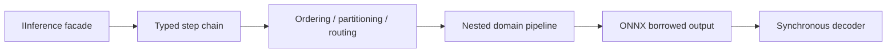

# High-Level Design

FAI composes finite, typed steps. A step receives one complete input value and writes into caller-owned output. An allocating step additionally owns the shape and lifetime of intermediate output through `BatchLease<T>`.

The DI builder validates adjacent stage types at compile time. A nested pipeline can become a stage in an enclosing pipeline, allowing policies to wrap a complete encode-model-decode chain. Batch semantics are supplied by static indexed-batch traits for memory and tensor values.

Allocating steps execute atomically when used as intermediates so input-dependent preparation is not repeated between allocation and execution. Runtime-owned model tensors are borrowed by synchronous decoders and remain valid only for the decoder callback. Materializing managed model output is an explicit adapter for callers that require ownership.
