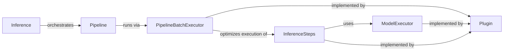

### High-Level Design

```mermaid
graph LR
  Pipeline[Pipeline]
  PipelineBatchExecutor[PipelineBatchExecutor]
  InferenceSteps[InferenceSteps]
  ModelExecutor[ModelExecutor]
  Inference[Inference]
  Plugin[Plugin]

  Inference -- orchestrates --> Pipeline
  Pipeline -- runs via --> PipelineBatchExecutor
  PipelineBatchExecutor -- optimizes execution of --> InferenceSteps
  InferenceSteps -- uses --> ModelExecutor

  PipelineBatchExecutor -- implemented by --> Plugin
  ModelExecutor -- implemented by --> Plugin
  InferenceSteps -- implemented by --> Plugin
```
