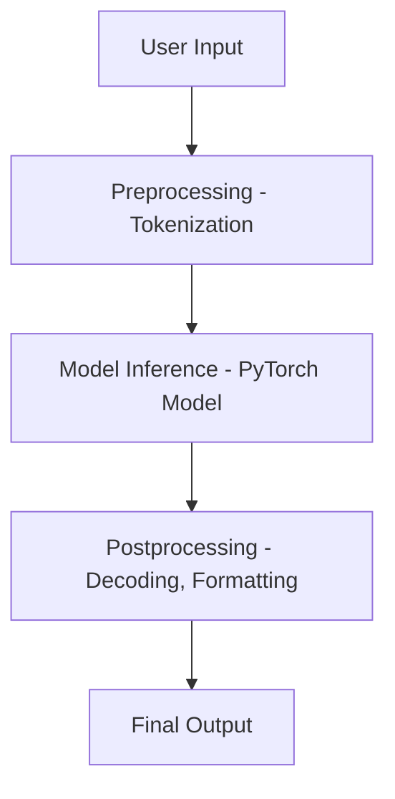

# Transformers Pipeline Design

AI Generated Summary:

---

### 🧠 Hugging Face Transformers Architecture Overview

The Hugging Face Transformers library is built on a modular architecture that separates concerns across tokenization,
modeling, and inference pipelines:

- **Tokenizer**: Framework-agnostic and shared across all runtimes. It handles preprocessing by converting raw text into
  token IDs and attention masks.
- **Model**: Framework-dependent. Each backend (PyTorch, TensorFlow, ONNX Runtime) has its own model class:
    - `AutoModelFor...` for PyTorch
    - `TFAutoModelFor...` for TensorFlow
    - `ORTModelFor...` for ONNX (via [Optimum](https://huggingface.co/docs/optimum))
- **Pipeline**: Both **task-specific** and **framework-specific**. Each task (e.g., text classification, question
  answering) has dedicated pipeline classes:
    - `TextClassificationPipeline` → PyTorch
    - `TFTextClassificationPipeline` → TensorFlow
    - `ORTTextClassificationPipeline` → ONNX Runtime

> ⚠️ **Note**: Although ONNX Runtime is designed to be framework-independent, the current implementation in Hugging
> Face’s Optimum library requires **PyTorch to be installed**, even for CPU-only inference. This is due to internal design
> limitations and unresolved bugs related to device selection and graph handling. Developers should be aware of this
> dependency when deploying ONNX models.
