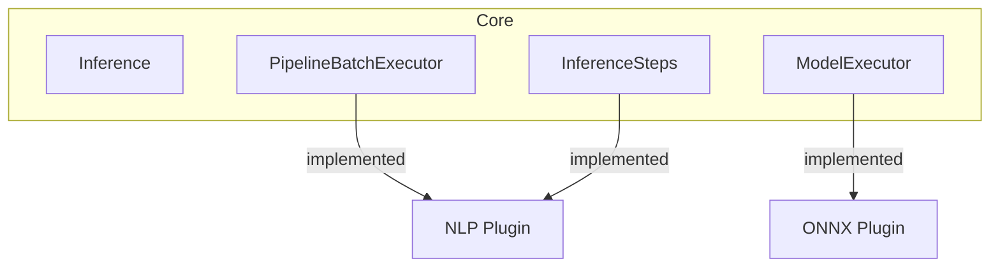
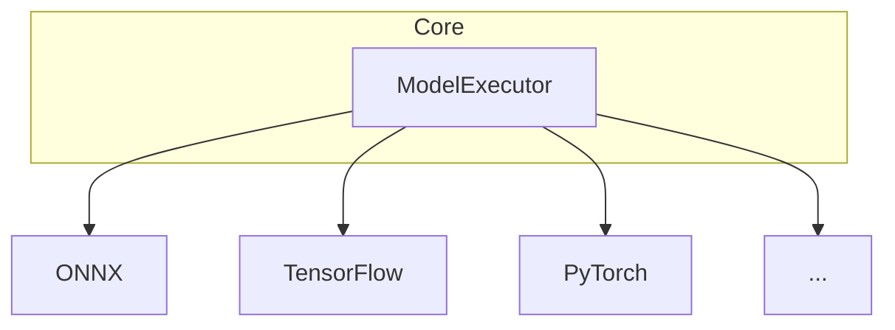
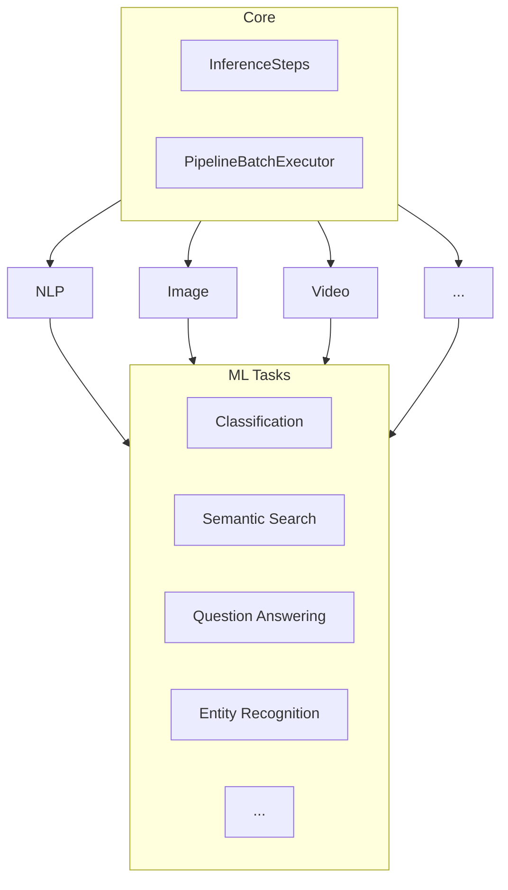
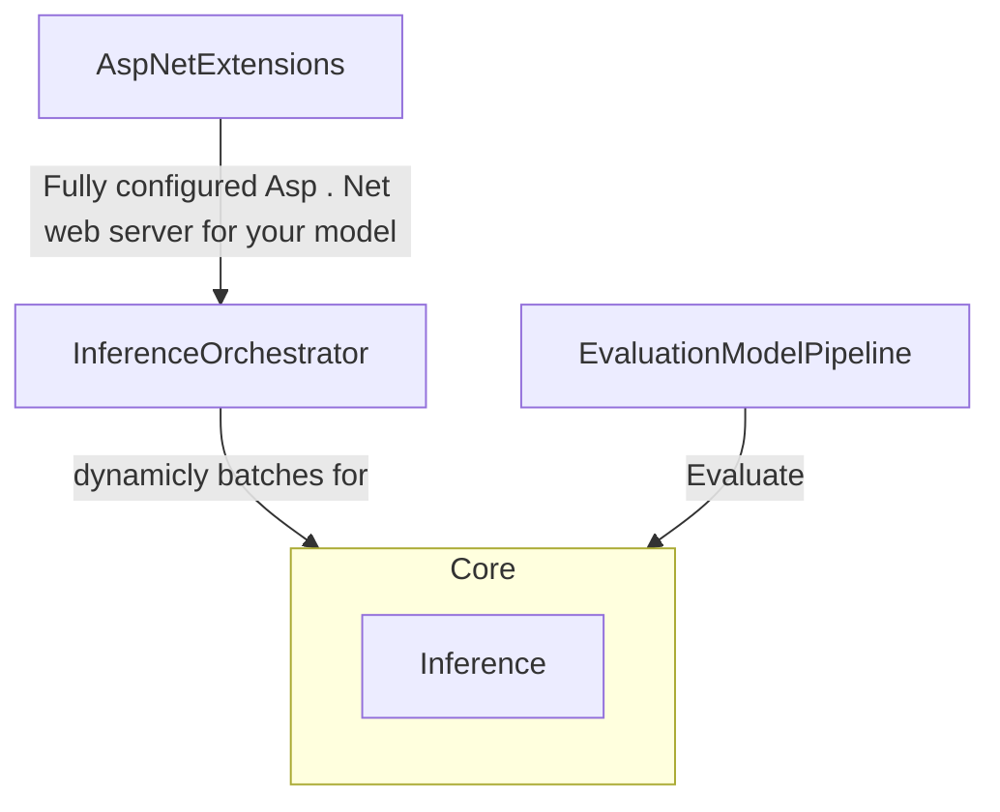

## Plugin Diagram

### Current:

### Could be:

#### ModelExecutor

Multiple packages implementing different model executors. Enabling loading different model representations and executing
them directly in this library in an optimized way.

#### InferenceSteps & PipelineBatchExecutor

For each inference task, we should create a package that implements that task in an optimized and standard way. Just
like hugging face has AutoModelForXXX we should have a package for XXX.

Usually each task comes with its own PipelineBatchExecutor strategies for optimizing its runtime and hardware
utilization, supporting both dynamic and static batching, with better latency or better throughput considerations.

#### Inference

The entire point is to allow you to write your own Inference algorithm and use highly optimized pipelines for your
models.

We have created an abstraction for this, and need to add better wrappers for the Inference algorithm so you can deal
with the algorithm and the rest just happens.

