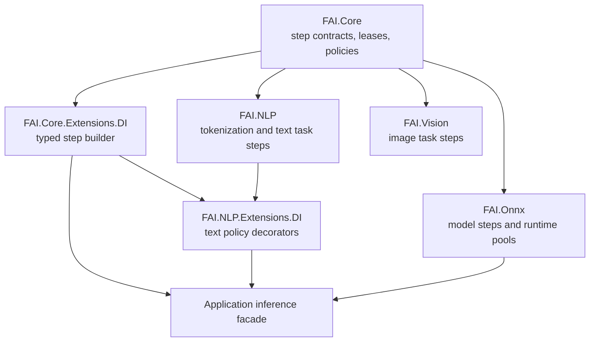

# Package Diagram

## Extension Model

Runtime packages implement `IStep` for model-specific disposable tensor outputs. Domain packages implement task steps and policies without introducing another execution abstraction. Steps that can derive storage synchronously from metadata may also implement `IPreallocatingStep`. Applications compose those pieces with `AddPipeline<TInput>()` and `Then<TOutput, TStep>()`, then expose an `IInference<TInput, TOutput>` facade where needed.
