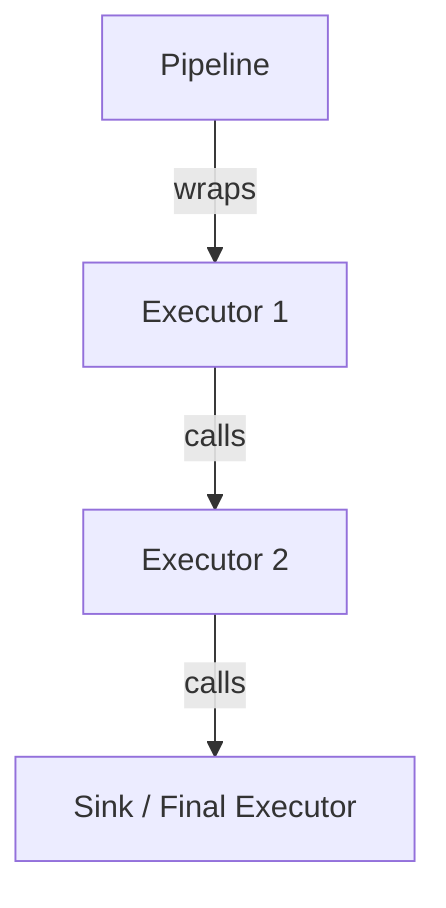

# Test Plan: FAI.Core.Extensions.DI

This project provides Dependency Injection (DI) extensions and a fluent `PipelineBuilder` for the FAI library. The testing strategy focuses on verifying the correct assembly of pipelines, executor chains, and service registrations.

## Core Objectives
- Verify `PipelineBuilder<TIn, TOut>` correctly assembles the middleware chain in the expected order.
- Ensure `IServiceCollection` extensions correctly register required services.
- Validate `PartitionBatchExecutorBuilder` correctly configures slicers and schedulers.
- Test `LocalServiceCollection` for service isolation and global delegation.
- Maintain CI compatibility by using mock implementations instead of real ONNX/ML models.

## Testing Framework & Tools
- **Framework**: `xunit.v3` (Microsoft Testing Platform).
- **Features**: Modern .NET 10 / C# 14 syntax (collection expressions `[]`, `System.Threading.Lock`).
- **Isolation**: Use `NSubstitute` or manual mocks for `IInferenceSteps`, `IModelExecutor`, and `IPipelineBatchExecutor`.

## Test Scenarios

### 1. PipelineBuilder Logic

The `PipelineBuilder` assembles the executor chain in reverse order (Middleware pattern).



- **Chain Order**:
    - Verify that calling `.Use<Exec1>().Use<Exec2>()` results in a chain: `Exec1 -> Exec2 -> Sink`.
    - Verify `UseSink<TSink>` replaces the default `SinkPipelineBatchExecutor`.
- **Service Registration**:
    - Verify `AddInferenceSteps<T>` adds the type as `IInferenceSteps<TIn, TOut>`.
    - Verify `AddModelExecutor` adds the factory to the service collection.
- **Build Process**:
    - Verify `Build(sp)` returns a functional `IPipeline<TIn, TOut>`.

### 2. Partitioning Configuration
- **Slicers/Schedulers**:
    - Verify `WithSerialSchedular` and `WithParallelSchedular` register the correct options and implementation types.
    - Verify custom slicer factories are correctly invoked during build.

### 3. Service Collection Extensions
- **Global Extensions**:
    - Verify `AddPipeline<TIn, TOut>` registers the pipeline as a singleton.
- **Local Services**:
    - Verify `AddLocalServices` allows scoped registrations that don't pollute the global container unless `CopyToGlobal` is used.
    - Verify `CopyToGlobal` correctly bridges the local and global containers.

### 4. Integration Verification (The "Smoke" Test)
- Assemble a complex pipeline:
  ```csharp
  services.AddPipeline<string, float[]>()
      .AddInferenceSteps<MockSteps>()
      .Use<LoggingExecutor>()
      .UsePartitioning(p => p.WithSerialSchedular("section"))
      .UseSink<MockSink>();
  ```
- Resolve `IPipeline<string, float[]>` and verify the internal structure (decorators).

## Implementation Details
- **Project**: `test/FAI.Core.Extensions.DI.Tests/FAI.Core.Extensions.DI.Tests.csproj`
- **Location**: `test/FAI.Core.Extensions.DI.Tests/`
- **Modern C#**:
    - Use `_lock = new System.Threading.Lock()` for any thread-safety tests.
    - Use `[item1, item2]` for collection initializers.

## Success Criteria
- [ ] All tests pass in the CI environment.
- [ ] 100% coverage of `PipelineBuilder` assembly logic.
- [ ] Correct instantiation of `PartitionPipelineBatchExecutor` confirmed.
- [ ] Service isolation in `LocalServiceCollection` verified.
