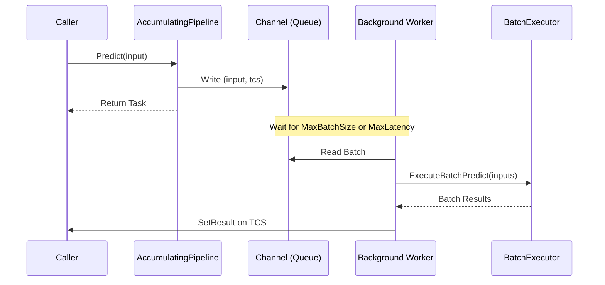
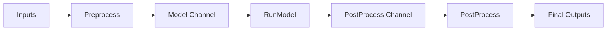

# Test Plan: FAI.Core

This document outlines the testing strategy for the `FAI.Core` project, focusing on unit tests for core abstractions, batching logic, and tensor utilities using `xunit.v3`.

## Goals
- Achieve high code coverage for core logic and abstractions.
- Ensure thread safety and correct behavior of concurrent components (Schedulers, AccumulatingPipeline).
- Verify memory-efficient tensor extensions.
- Maintain a fast, hardware-independent test suite suitable for CI.

## Testing Strategy

### 1. Framework and Tools
- **Test Framework**: [xunit.v3](https://xunit.net/docs/getting-started/v3/microsoft-testing-platform)
- **Mocking Library**: [NSubstitute](https://nsubstitute.github.io/) (for mocking interfaces like `IPipelineBatchExecutor` or `IInferenceSteps`).
- **Assertions**: Standard `xUnit` assertions (e.g., `Assert.Equal`, `Assert.NotNull`, etc.).

### 2. Test Categories

#### A. Tensor Extensions (`TensorExtensions.cs`)
Since these extensions use `UnsafeAccessor` to access internal fields of `System.Numerics.Tensors.Tensor<T>`, they must be tested thoroughly.
- **Tests**:
    - `AsSpan` for `TensorSpan<T>` and `ReadOnlyTensorSpan<T>`.
    - `AsMemory` for `Tensor<T>`.
    - Verify that modifications through the returned `Span` or `Memory` reflect in the original tensor.

#### B. Batch Slicers (`BatchSlicers/`)
- **FixedSizeBatchSlicer**:
    - Test with inputs smaller than batch size.
    - Test with inputs exactly matching multiple of batch size.
    - Test with inputs having a remainder.
    - Test with empty inputs.

#### C. Batch Schedulers (`BatchSchedulers/`)
- **SerialBatchSchedular**:
    - Verify sequential execution of all ranges.
    - Verify all outputs are correctly mapped from the executor calls.
- **ParallelBatchSchedular**:
    - Verify all ranges are processed.
    - Verify max concurrency limits are respected (using a mock executor that tracks active counts).

#### D. Pipeline Batch Executors (`PipelineBatchExecutors/`)
- **SinkPipelineBatchExecutor**: Simple delegation to `IInferenceSteps`.
- **PartitionPipelineBatchExecutor**: Verify it uses the slicer and scheduler correctly.
- **PipelineLinkBatchExecutor**:
    - Verify the mapping function `Func<TInput, TNextInput>` is applied to all items.
    - Verify correct interaction with `ArrayPool`.
- **BackgroundPipelineBatchExecutor**:
    - Verify it offloads to background tasks.
    - Verify error propagation from background worker to the caller's `Task`.
- **RoutingPipelineBatchExecutor**:
    - Verify ranges are correctly copied to sub-arrays and back.
- **StreamedBatchExecutor**:
    - Test the internal pipelining logic (Preprocess -> Model -> Postprocess).
    - Verify error handling at each stage.
    - Test parallel vs. serial preprocessing modes.

#### E. Inference Tasks & Result Types (`InferenceTasks/`, `ResultTypes/`)
- **ClassificationTask**:
    - Verify it correctly maps inputs through Preprocess, RunModel, and PostProcess.
    - Verify `ClassificationTensorUtils` for correct tensor conversions.
- **PooledModelExecutor**:
    - Verify that multiple requests get distributed to underlying executors (use mocks).

#### F. Pipelines (`Pipelines/`)
- **Pipeline<TIn, TOut>**: Basic wrapper tests.
- **AccumulatingPipeline<TIn, TOut>**: (Critical)
    - Test `MaxBatchSize` trigger: Fill a batch and ensure it's flushed.
    - Test `MaxLatency` trigger: Add one item and wait for timeout to ensure it's flushed.
    - Test `BufferCapacity` (Backpressure): Verify it blocks/waits when full.
    - Test `FailedBatchPolicy` interaction when the executor throws.
    - Test `UnpackBatch` option behavior.

### 3. CI Environment & Performance
- All tests must use **synthetic data** (small arrays/tensors) or **mocks**.
- No reliance on ONNX Runtime or actual GPU hardware in `FAI.Core.Tests`.
- Use `Task.Delay` with small values or `TaskCompletionSource` to simulate async work in concurrency tests.

## Proposed Project Structure
```text
test/FAI.Core.Tests/
├── TensorExtensionsTests.cs
├── BatchSlicerTests/
│   └── FixedSizeBatchSlicerTests.cs
├── BatchSchedularTests/
│   ├── SerialBatchSchedularTests.cs
│   └── ParallelBatchSchedularTests.cs
├── PipelineBatchExecutorTests/
│   ├── PipelineLinkBatchExecutorTests.cs
│   ├── BackgroundPipelineBatchExecutorTests.cs
│   └── StreamedBatchExecutorTests.cs
└── PipelineTests/
    └── AccumulatingPipelineTests.cs
```

## Mermaid Diagrams

### AccumulatingPipeline Workflow


### StreamedBatchExecutor Stages

