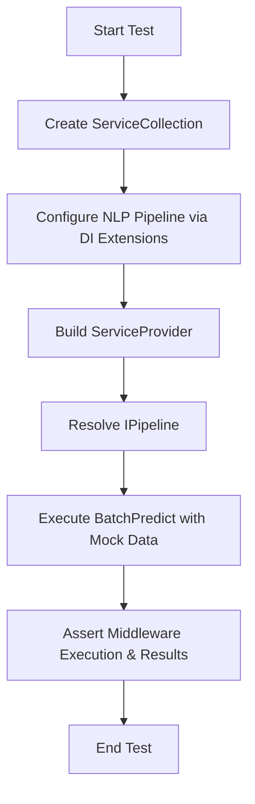

# Test Plan: FAI.NLP.Extensions.DI

This plan outlines the testing strategy for the `src/FAI.NLP.Extensions.DI` project, focusing on integration tests for the dependency injection extensions and fluent builders.

## Goals
- Verify `PipelineBuilder` extensions for NLP (`UseTokenSorting`, `UseTokenizing`).
- Verify `PartitionBatchExecutorBuilder` extensions for NLP (`WithMaxPaddedTokens`).
- Verify specialized pipeline shortcuts (`WithTextClassification`).
- Ensure corect registration and resolution of NLP-specific components using `Microsoft.Extensions.DependencyInjection`.

## Testing Strategy

### 1. Registration & Resolution Tests
- **UseTokenSorting**:
    - Test registration with explicit options.
    - Test registration via configuration binding (using `IConfiguration`).
    - Verify `TokenCountSortingBatchExecutor` is correctly resolved and inserted into the pipeline.
- **UseTokenizing**:
    - Verify `TokenizerBatchExecutor` is correctly resolved and inserted.
- **WithTextClassification**:
    - Verify `ClassificationOptions` are bound from configuration.
    - Verify `TextClassification` inference steps are registered.
- **WithMaxPaddedTokens (Partitioning)**:
    - Verify `MaxPaddedTokensSlicerOptions` are bound.
    - Verify `MaxPaddedTokensBatchSlicer` is registered as the `IBatchSlicer`.

### 2. Integration Tests
- Build a full NLP pipeline using the DI extensions.
- Execute a mock prediction to ensure the middleware chain (executors) is invoked in the expected order.
- Use `NSubstitute` for mocking dependencies if needed, or use mock implementation classes similar to `FAI.Core.Extensions.DI.Tests`.

## Implementation Details
- **Framework**: `xunit.v3`
- **Features**: .NET 10 / C# 14 (Collection expressions, Primary constructors where applicable).
- **Project**: `test/FAI.NLP.Extensions.DI.Tests/FAI.NLP.Extensions.DI.Tests.csproj`
- **Location**: `test/FAI.NLP.Extensions.DI.Tests/`

## Proposed Test Files
- `test/FAI.NLP.Extensions.DI.Tests/BatchExecutorExtensionsTests.cs`: Comprehensive tests for all extensions in [`BatchExecutorExtensions.cs`](src/FAI.NLP.Extensions.DI/BatchExecutorExtensions.cs).

## Mermaid Workflow

