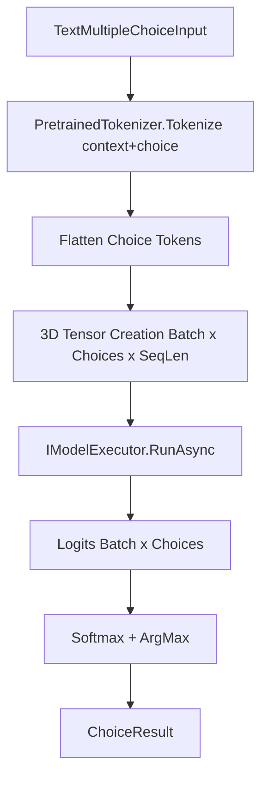

# Test Plan - FAI.NLP

This plan outlines the testing strategy for the [`FAI.NLP`](src/FAI.NLP) project. The goal is to ensure the reliability and performance of NLP-specific components, including tokenization, batch slicing, and task-specific logic.

## 1. Objectives

- Verify [`PretrainedTokenizer`](src/FAI.NLP/Tokenization/PretrainedTokenizer.cs) correctly handles padding, truncation, and tensor generation.
- Ensure batch slicers ([`MaxPaddedTokensBatchSlicer`](src/FAI.NLP/BatchSlicer/MaxPaddedTokensBatchSlicer.cs)) correctly group inputs based on token count constraints.
- Validate batch executors ([`TokenCountSortingBatchExecutor`](src/FAI.NLP/PipelineBatchExecutors/TokenCountSortingBatchExecutor.cs), [`TokenBatchSizeBatchExecutor`](src/FAI.NLP/PipelineBatchExecutors/TokenBatchSizeBatchExecutor.cs)) correctly manage batch flow.
- Confirm [`TextClassificationTask`](src/FAI.NLP/InferenceTasks/TextClassification/TextClassificationTask.cs) and [`TextMultipleChoiceTask`](src/FAI.NLP/InferenceTasks/TextMultipleChoice/TextMultipleChoiceTask.cs) correctly orchestrate preprocessing, model execution, and post-processing.

## 2. Testing Strategy

### 2.1 Unit Tests (Component Isolation)

- **[`PretrainedTokenizer`](src/FAI.NLP/Tokenization/PretrainedTokenizer.cs)**:
  - Use a simple `Microsoft.ML.Tokenizers.BertTokenizer` (e.g., with a small vocab) for testing logic.
  - Test `Tokenize` with single and pair inputs.
  - Test `TruncationOption` (Longest, Context, Text).
  - Test `BatchTokensToTensors` for correct shape and padding values.

- **Batch Slicing**:
  - [`MaxPaddedTokensBatchSlicer`](src/FAI.NLP/BatchSlicer/MaxPaddedTokensBatchSlicer.cs): Test with controlled `ITokenizable` inputs to verify boundary conditions for `MaxTokenCount` and `MaxPaddedTokenRatio`.

- **Batch Executors**:
  - [`TokenCountSortingBatchExecutor`](src/FAI.NLP/PipelineBatchExecutors/TokenCountSortingBatchExecutor.cs): Verify sorting and re-ordering logic.
  - [`TokenBatchSizeBatchExecutor`](src/FAI.NLP/PipelineBatchExecutors/TokenBatchSizeBatchExecutor.cs): Verify sub-batching logic.

### 2.2 Integration Tests (Pipeline Flow)

- **Tasks**:
  - [`TextClassificationTask`](src/FAI.NLP/InferenceTasks/TextClassification/TextClassificationTask.cs): Mock [`IModelExecutor<long, float>`](src/FAI.Core/Abstractions.cs:51) to verify input/output mapping.
  - [`TextMultipleChoiceTask`](src/FAI.NLP/InferenceTasks/TextMultipleChoice/TextMultipleChoiceTask.cs): Verify 3D tensor generation and choice mapping.

## 3. Implementation Details

- **Test Framework**: `xunit.v3` with Microsoft Testing Platform (MTP).
- **Mocking Library**: `NSubstitute`.
- **Modern C#**: Use collection expressions `[]` for tensors and arrays.
- **Constraints**: NEVER modify library code. Use `dotnet format` after passing tests.

## 4. Proposed Test Structure

```
test/FAI.NLP.Tests/
├── Tokenization/
│   └── PretrainedTokenizerTests.cs
├── BatchSlicer/
│   └── MaxPaddedTokensBatchSlicerTests.cs
├── PipelineBatchExecutorTests/
│   ├── TokenCountSortingBatchExecutorTests.cs
│   └── TokenBatchSizeBatchExecutorTests.cs
├── InferenceTasks/
│   ├── TextClassificationTaskTests.cs
│   └── TextMultipleChoiceTaskTests.cs
└── Mocks/
    └── DummyTokenizerFactory.cs
```

## 5. Mermaid Diagram: `TextMultipleChoiceTask` Workflow



## 6. CI Compatibility

Tensors will be generated using `System.Numerics.Tensors`. Models will be mocked using `NSubstitute` to avoid heavy ONNX Runtime dependencies in unit tests. Tokenizer tests will use a minimal `BertTokenizer` configuration to keep it fast and light.
